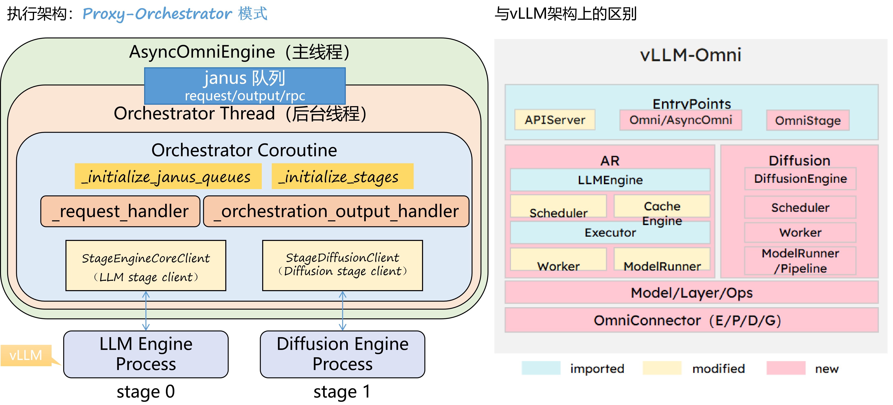

# Alpamayo-1.5 适配说明

本文档描述 `f55ea28(v0.18.0)` 到 `28a4791066db609068fbbb8f9f69dd7cd803a928` 之间，为 `Alpamayo-1.5` 接入 `vllm-omni` 所做的完整适配。

## 1. 改动概览

- 对比范围：`f55ea28(v0.18.0)..28a4791066db609068fbbb8f9f69dd7cd803a928`
- 变更规模：36 个文件，`5882` 行新增，`24` 行删除
- 目标：把原始 Alpamayo 的“两段式 VLA 推理链路”接入 vllm-omni
  - stage 0：真实 VLM backbone，负责视觉理解与 COT / future-start token 生成
  - stage 1：trajectory head，消费 stage 0 的 token、KV cache 与辅助张量，输出轨迹

适配完成后，`vllm-omni` 不再把 Alpamayo 当作单一模型直接跑，而是作为一个明确的两阶段 pipeline 来运行。

## 2. 总体架构变化

基线 `f55ea28(v0.18.0)` 中没有 Alpamayo-1.5 的专用 pipeline。目标提交引入了一套新的两阶段拓扑，入口配置见 [alpamayo1_5.yaml](../../../vllm_omni/model_executor/stage_configs/alpamayo1_5.yaml)：

1. stage 0 是 `llm` stage
   - `model_arch: Alpamayo1_5Qwen3VLForConditionalGeneration`
   - `worker_type: ar`
   - 负责多模态输入展开、文本 token 生成、latent 与若干辅助张量产出

2. stage 1 是 `diffusion` stage
   - `model_arch: Alpamayo1_5TrajectoryPipeline`
   - `engine_input_source: [0]`
   - `final_output_type: trajectory`
   - 消费 stage 0 的输出和 KV cache，生成最终轨迹

3. 两个 stage 之间有两条传输通道
   - 主数据通道：通过 `custom_process_input_func` 把 stage 0 `RequestOutput` 重写成 stage 1 的 `OmniTextPrompt`
   - KV cache 通道：通过 `omni_kv_config` 配置的 connector 直接在 stage 间传 KV

因此，这次适配的核心不是“加一个模型类”这么简单，而是把 Alpamayo 的原始推理结构拆成了 `vllm-omni` 能编排的 stage DAG。

## 3. 配置与注册层改动

### 3.1 StageConfig 新增 hook 能力

[stage_config.py](../../../vllm_omni/config/stage_config.py) 为 stage 新增了几类重要扩展点：

- `prompt_rewrite_func`
- `renderer_rewrite_func`
- `request_postprocess_func`
- `custom_process_input_func`

它们分别对应：

- 进入 `InputProcessor` 之前改 prompt
- 在构造 `InputProcessor` 前替换 renderer(tokenizer)
- `InputProcessor.process_inputs()` 之后再改 request
- 上一 stage 完成后，把输出重写成下一 stage 的输入

这些 hook 是 Alpamayo 能接进现有框架的基础。

### 3.2 模型/配置注册

新增或扩展了以下注册点：

- [vllm_omni/model_executor/models/registry.py](../../../vllm_omni/model_executor/models/registry.py)
- [vllm_omni/model_executor/models/alpamayo1_5/__init__.py](../../../vllm_omni/model_executor/models/alpamayo1_5/__init__.py)
- [vllm_omni/model_executor/models/alpamayo1_5/alpamayo1_5_qwen3vl.py](../../../vllm_omni/model_executor/models/alpamayo1_5/alpamayo1_5_qwen3vl.py)
- [vllm_omni/diffusion/registry.py](../../../vllm_omni/diffusion/registry.py)
- [vllm_omni/diffusion/models/alpamayo1_5/__init__.py](../../../vllm_omni/diffusion/models/alpamayo1_5/__init__.py)
- [vllm_omni/transformers_utils/configs/alpamayo1_5.py](../../../vllm_omni/transformers_utils/configs/alpamayo1_5.py)

对应结果是：

- stage 0 可以按 Alpamayo checkpoint 方式加载 Qwen3-VL backbone
- stage 1 可以按 diffusion pipeline 方式加载 trajectory head
- Alpamayo 自定义 HF config 字段可以被框架识别
- stage 0 / stage 1 各自的本地 runtime 工具也有了明确归属，后续不必继续把大段基础组件堆在单个 pipeline 文件里

## 4. Stage 0 适配

## 4.1 自定义 VLM 模型包装与本地 runtime 工具

[alpamayo1_5_qwen3vl.py](../../../vllm_omni/model_executor/models/alpamayo1_5/alpamayo1_5_qwen3vl.py) 做了两件关键事：

1. 复原 stage 0 应该使用的 Qwen3-VL HF config
   - 从 Alpamayo `config.json` 中读取 `vlm_name_or_path`
   - 用原始 Qwen3-VL config 作为底座
   - 再把 Alpamayo 扩展后的 `vocab_size` 覆盖进去

2. 过滤 checkpoint 权重
   - 只把 `vlm.` 前缀下的权重映射到 stage 0
   - `action_in_proj`、`action_out_proj`、`expert` 等 stage 1 模块不会混进 stage 0

这保证了一个混合 checkpoint 可以被拆开，分别供两个 stage 使用。

同时，[runtime.py](../../../vllm_omni/model_executor/models/alpamayo1_5/runtime.py) 把 stage 0 侧的运行时基础能力单独沉淀出来，包括：

- `TRAJ_TOKEN` / `SPECIAL_TOKENS`
- 本地 history trajectory tokenizer 实现
- `tokenize_history_trajectory()`

这样 [alpamayo1_5.py](../../../vllm_omni/model_executor/stage_input_processors/alpamayo1_5.py) 只负责输入改写与 stage 间数据转换，不再同时承载大量底层 token/runtime 定义。

## 4.2 Stage 0 输入链路

Alpamayo 的 stage 0 输入适配集中在 [alpamayo1_5.py](../../../vllm_omni/model_executor/stage_input_processors/alpamayo1_5.py)。

### a. `prompt_rewrite_func`

`rewrite_stage0_prompt_for_vllm_multimodal()` 会在 vLLM 做 multimodal expand 之前：

- 从 Alpamayo `config.json` 注入 `min_pixels` / `max_pixels`
- 把原始 prompt 文本存进 `additional_information["stage0_prompt_text"]`

目的：让 vLLM 的多模态预处理使用与 Alpamayo 原始推理一致的图像处理参数。

### b. `renderer_rewrite_func`

`build_alpamayo_stage0_renderer()` 会在 `InputProcessor` 初始化之前构造自定义 renderer：

- 先构造 Alpamayo 扩展 tokenizer
- 再用这个 tokenizer 创建 renderer / mm processor

这是这次适配里非常关键的一步，因为 Alpamayo 依赖额外 trajectory token；如果太晚才替换 tokenizer，就会出现 placeholder token 和真实 token id 对不上的问题。

### c. `request_postprocess_func`

`postprocess_stage0_request_for_traj_fusion()` 运行在 `InputProcessor.process_inputs()` 之后：

- 找到 prompt token ids 里的 `<|traj_history|>` 占位 token
- 用 `ego_history_xyz` / `ego_history_rot` 真正编码出的轨迹 token 替换这些 placeholder
- 回写 `request.prompt_token_ids`
- 同步更新 `additional_information["tokenized_data"]`

换句话说，stage 0 最终送进 model runner 的 token 序列，已经是“视觉 token + 文本 token + 融合后的历史轨迹 token”。

## 4.3 Stage 0 停止语义与 KV 边界

[alpamayo1_5_stop_after_future_start.py](../../../vllm_omni/model_executor/stage_input_processors/alpamayo1_5_stop_after_future_start.py) 新增了 `AlpamayoStopAfterFutureStartLogitsProcessor`。

它的作用不是简单停止，而是复现原始 Alpamayo 的语义：

1. 当模型生成 `<|traj_future_start|>` 时
2. 下一个 step 强制输出指定 stop token
3. vLLM 在这个 stop token 处停止

这样做的意义是：KV cache 会比 `future_start` 再向前推进一步，和原始 HuggingFace 路径保持一致，方便 stage 1 直接接着 rollout。

YAML 里同时配了：

- `stop_token_ids`
- `alpamayo_stop_after_token_id`
- `alpamayo_forced_stop_token_id`
- `omni_kv_config.kv_transfer_criteria.type: special_token`

所以 stage 0 的停止与 KV 发送边界是一起设计的。

## 5. Stage 0 输出与输出处理

## 5.1 Model runner 侧新增信息

[gpu_model_runner.py](../../../vllm_omni/worker/gpu_model_runner.py) 和 [gpu_ar_model_runner.py](../../../vllm_omni/worker/gpu_ar_model_runner.py) 让 stage 0 除了 token 之外，还能携带 Alpamayo 后续要用的信息。

主要包括：

- `mrope_positions`
- `mrope_position_delta`
- `additional_information`
- 多模态中间输出
- KV transfer metadata

其中最重要的一点是：`_init_mrope_positions()` 会把 `req_state.mrope_position_delta` 算出来并挂在 request state 上，后续再进入输出 payload。

## 5.2 OutputProcessor 的多模态累计

[output_processor.py](../../../vllm_omni/engine/output_processor.py) 新增 `OmniRequestState`，它在原有 text output 之外还能累计多模态张量。

核心行为：

- 每轮 decode 的 payload 不立即强拼接，而是先缓存在 `mm_accumulated`
- 请求 finished 时才做 consolidate
- 对以下 key 不做普通 concat，而是保留最后一份或按专门语义处理：
  - `attention_mask`
  - `initial_noise_x0`
  - `position_ids`
  - `prompt_mrope_position_delta`
  - `rope_deltas`

最终，stage 0 对外发出的仍然是 `RequestOutput`，只是其中每个 `CompletionOutput` 多带了一份 `multimodal_output` 字典。

## 6. Stage 0 -> Stage 1 数据改写

这个阶段的核心函数是 [alpamayo1_5.py](../../../vllm_omni/model_executor/stage_input_processors/alpamayo1_5.py) 里的 `vlm2trajectory()`。

它读取 stage 0 `RequestOutput`，再和原始请求的 `additional_information` 合并，构造 stage 1 所需上下文。主要写入：

- `stage0_prompt_token_ids`
- `stage0_output_token_ids`
- `stage0_sequences`
- `stage0_prompt_length`
- `stage0_output_length` / `stage0_output_lengths`
- `stage0_num_return_sequences`
- `num_return_sequences`
- `stage0_latent`
- `stage0_latent_shape`
- `initial_noise_x0`
- `stage0_rope_deltas`
- `stage0_attention_mask`
- `stage0_prefill_seq_len` / `stage0_prefill_seq_lens`

> 注：这些数据存在冗余，目前为了稳定，还未进行优化

这里尤其要注意三类信息：

### 6.1 token 序列

`stage0_sequences = prompt_token_ids + output_token_ids`

这是 stage 1 还原 rollout 语境的主依据，必须包含 `future_start`。

### 6.2 rope 相关信息

当前实现中，stage 1 最终消费的是 `stage0_rope_deltas`，它来自 stage 0 输出里的 `prompt_mrope_position_delta` 归一化结果。

也就是说：

- stage 0 runner 产出的是 `prompt_mrope_position_delta`
- `vlm2trajectory()` 把它整理成 `stage0_rope_deltas`
- stage 1 pipeline 只认 `stage0_rope_deltas`

### 6.3 initial noise

`initial_noise_x0` 可能来自原始请求 `additional_information`，也可能经过 stage 0 输出链路继续往下传。

无论来源如何，到了 `vlm2trajectory()` 之后，它都会被明确放进 stage 1 的 `additional_information`，成为 trajectory rollout 的输入之一。

## 7. Stage 1 轨迹头适配

## 7.1 新增 diffusion pipeline 与 stage 1 runtime 拆分

[pipeline_alpamayo1_5.py](../../../vllm_omni/diffusion/models/alpamayo1_5/pipeline_alpamayo1_5.py) 是这次适配的主体。

它承担的职责包括：

- 读取 Alpamayo `config.json`
- 初始化 stage 1 的参考模块
  - `action_space`
  - `diffusion`
  - `action_in_proj`
  - `action_out_proj`
  - `expert`
- 接收 stage 0 传来的 KV cache 与上下文
- 构造 rollout 所需位置编码与 attention mask
- 输出最终 `pred_xyz` / `pred_rot` / `cot_token_ids`

不过当前范围内，stage 1 不再把所有基础模块都塞在一个文件里。[runtime.py](../../../vllm_omni/diffusion/models/alpamayo1_5/runtime.py) 已经把下列运行时组件拆出去：

- `ActionSpace` 抽象与 `UnicycleAccelCurvatureActionSpace`
- `FlowMatching`
- `PerWaypointActionInProjV2`
- 若干轨迹平滑、角度处理与约束求解工具函数

因此现在的结构更接近“两层分工”：

- `pipeline_alpamayo1_5.py` 负责 stage 1 的框架接入、上下文整理和 rollout 调度
- `runtime.py` 负责 Alpamayo 轨迹扩散本身的运行时数学/模块实现

## 7.2 rollout context 构建

`_prepare_rollout_context()` 是 stage 1 最核心的上下文整理函数。它从 `additional_information` 和 `sampling_params` 中提取：

- `stage0_sequences`
- `past_key_values`
- `stage0_rope_deltas`
- `stage0_attention_mask`
- `initial_noise_x0`

处理过程大致是：

1. 从 `sampling_params.past_key_values` 重建 `DynamicCache`
2. 把 `stage0_sequences` 变成 batch 化的 long tensor
3. 校验 sequence 必须包含 `future_start_id`
4. 把 `stage0_rope_deltas` 规范成 `[B, 1]`
5. 把 `stage0_attention_mask` 扩展到 rollout batch
6. 把 `initial_noise_x0` 扩展到 rollout batch

这里的 `assert future_start_id` 很关键，它让 stage 1 不再隐式兜底，而是明确要求 stage 0 交付可 rollout 的完整语境。

## 7.3 KV cache 传入 stage 1

KV cache 不是通过 `additional_information` 传的，而是走 `sampling_params.past_key_values`。

对应链路是：

1. stage 0 在 special token 条件满足时发送 KV
2. diffusion stage 根据 `omni_kv_config.need_recv_cache: true` 接收 KV
3. [diffusion_model_runner.py](../../../vllm_omni/diffusion/worker/diffusion_model_runner.py) 在执行请求前完成 KV 接收
4. `pipeline_alpamayo1_5.py` 把收到的 KV 重建成 `DynamicCache`

因此，stage 1 的 rollout 依赖的是两份数据：

- 文本/张量上下文：来自 `vlm2trajectory()`
- 历史注意力上下文：来自传输过来的 KV cache

## 8. 引擎初始化与调度链路变化

## 8.1 AsyncOmniEngine 接入新 hook

[async_omni_engine.py](../../../vllm_omni/engine/async_omni_engine.py) 的主要适配点：

- 通过 `extract_stage_metadata()` 读取 stage hook
- stage 0 attach 时，优先用 `renderer_rewrite_func` 创建 custom renderer
- 用这个 renderer 构造 `InputProcessor`
- 再把 `prompt_rewrite_func` / `request_postprocess_func` 保存到 stage 0 输入链路
- diffusion stage 则按 `initialize_diffusion_stage()` 启动

这让 Alpamayo 的特殊 tokenizer / renderer 需求没有侵入 vLLM 的通用 `InputProcessor` 实现。

## 8.2 Orchestrator 仍然负责 stage 间编排

适配没有改变 `AsyncOmniEngine -> Orchestrator` 的总结构，但让 orchestrator 多承担了一层“跨 stage 数据改写”的职责：

- stage 0 正常产生 `RequestOutput`
- orchestrator 调用 `custom_process_input_func`
- 结果转成 stage 1 的 `OmniTextPrompt`
- 同时 stage 1 通过独立 connector 收到 KV cache

所以 stage 之间并不是直接传 runner 内部结构，而是：

- 输出对象走 orchestrator 路由
- KV 走 connector
- 最后在 stage 1 pipeline 汇合

## 9. 调试与验证工具

这次适配还新增了一整套验证脚本，主要分成两类。

### 9.1 调试 dump 工具

- [request_state_dump.py](../../../vllm_omni/debug/request_state_dump.py)
- [compare_request_state_dump.py](../../../vllm_omni/debug/compare_request_state_dump.py)
- [alpamayo_stage1_rollout_dump.py](../../../vllm_omni/debug/alpamayo_stage1_rollout_dump.py)

它们用于在关键 phase 导出：

- `prompt_token_ids`
- `output_token_ids`
- `mrope_positions`
- `mrope_position_delta`
- `mm_features`
- `additional_information`
- stage 1 rollout 输入

适合排查“HF 原始路径”和“vllm-omni 两阶段路径”在中间态上的差异。

### 9.2 测试脚本

新增测试集中在 `tests/diffusion/models/alpamoya/custom_test/`：

- `alpamoya_test.py`
- `alpamoya_2stage_test.py`
- `alpamoya_compare_original.py`
- `alpamoya_fixed_x0_compare.py`
- `alpamoya_repro_check.py`
- `alpamoya_single_batch_test.py`
- `common.py`

其中：

- `alpamoya_2stage_test.py` 用于直接跑通两阶段 pipeline
- `alpamoya_compare_original.py` 用于与原始 Alpamayo 推理链路逐步比对
- `alpamoya_fixed_x0_compare.py` 用于固定 `initial_noise_x0` 做可重复对比
- `alpamoya_repro_check.py` 用于做复现性检查
- `alpamoya_single_batch_test.py` 用于在一次 Omni 调用里验证多 prompt / batch 化场景
- `common.py` 提供共享的数据加载、prompt 构造、两阶段 YAML 生成与 sampling params 构造逻辑

## 10. 端到端数据流

下面给出这次适配后的完整数据流。

1. 用户传入 prompt
   - `prompt`
   - `multi_modal_data.image`
   - `additional_information`
     - 例如 `ego_history_xyz`、`ego_history_rot`、`initial_noise_x0`

2. stage 0 `prompt_rewrite_func`
   - 注入 Alpamayo 所需 `mm_processor_kwargs`

3. stage 0 `renderer_rewrite_func`
   - 提前创建带 Alpamayo tokenizer 的 renderer / mm processor

4. `InputProcessor`
   - 完成多模态展开，得到 prompt token ids 与 mm features

5. stage 0 `request_postprocess_func`
   - 用真实 history trajectory token 替换 `<|traj_history|>` 占位 token

6. stage 0 model runner 执行
   - 生成 COT 与 `future_start`
   - 产生 latent / `prompt_mrope_position_delta` / attention mask 等附加输出
   - 在指定 stop 边界发送 KV cache

7. `OutputProcessor`
   - 累计多模态输出
   - finished 时整理为最终 `RequestOutput`

8. `vlm2trajectory()`
   - 从 `RequestOutput` 和原始 `additional_information` 生成 stage 1 输入
   - 补齐 `stage0_sequences`、`stage0_rope_deltas`、`initial_noise_x0` 等字段

9. orchestrator 把 stage 1 请求发给 diffusion stage
   - 主输入走 request 路由
   - KV cache 走 connector

10. stage 1 pipeline
   - 从 `past_key_values` 重建 `DynamicCache`
   - 从 `stage0_sequences` 恢复 rollout offset
   - 用 `stage0_rope_deltas` / `stage0_attention_mask` / `initial_noise_x0` 构造 rollout context
   - 输出最终 trajectory

## 11. 关键文件清单

按职责分组如下。

### 配置与注册

- [vllm_omni/config/stage_config.py](../../../vllm_omni/config/stage_config.py)
- [vllm_omni/model_executor/stage_configs/alpamayo1_5.yaml](../../../vllm_omni/model_executor/stage_configs/alpamayo1_5.yaml)
- [vllm_omni/transformers_utils/configs/alpamayo1_5.py](../../../vllm_omni/transformers_utils/configs/alpamayo1_5.py)
- [vllm_omni/model_executor/models/registry.py](../../../vllm_omni/model_executor/models/registry.py)
- [vllm_omni/diffusion/registry.py](../../../vllm_omni/diffusion/registry.py)

### stage 0 适配

- [vllm_omni/model_executor/models/alpamayo1_5/alpamayo1_5_qwen3vl.py](../../../vllm_omni/model_executor/models/alpamayo1_5/alpamayo1_5_qwen3vl.py)
- [vllm_omni/model_executor/models/alpamayo1_5/runtime.py](../../../vllm_omni/model_executor/models/alpamayo1_5/runtime.py)
- [vllm_omni/model_executor/stage_input_processors/alpamayo1_5.py](../../../vllm_omni/model_executor/stage_input_processors/alpamayo1_5.py)
- [vllm_omni/model_executor/stage_input_processors/alpamayo1_5_stop_after_future_start.py](../../../vllm_omni/model_executor/stage_input_processors/alpamayo1_5_stop_after_future_start.py)
- [vllm_omni/worker/gpu_model_runner.py](../../../vllm_omni/worker/gpu_model_runner.py)
- [vllm_omni/worker/gpu_ar_model_runner.py](../../../vllm_omni/worker/gpu_ar_model_runner.py)
- [vllm_omni/engine/output_processor.py](../../../vllm_omni/engine/output_processor.py)

### stage 1 适配

- [vllm_omni/diffusion/models/alpamayo1_5/pipeline_alpamayo1_5.py](../../../vllm_omni/diffusion/models/alpamayo1_5/pipeline_alpamayo1_5.py)
- [vllm_omni/diffusion/models/alpamayo1_5/runtime.py](../../../vllm_omni/diffusion/models/alpamayo1_5/runtime.py)
- [vllm_omni/diffusion/worker/diffusion_model_runner.py](../../../vllm_omni/diffusion/worker/diffusion_model_runner.py)

### 引擎与初始化

- [vllm_omni/engine/async_omni_engine.py](../../../vllm_omni/engine/async_omni_engine.py)
- [vllm_omni/engine/stage_init_utils.py](../../../vllm_omni/engine/stage_init_utils.py)
- [vllm_omni/engine/orchestrator.py](../../../vllm_omni/engine/orchestrator.py)
- [vllm_omni/entrypoints/async_omni_diffusion.py](../../../vllm_omni/entrypoints/async_omni_diffusion.py)

### 调试与验证

- [vllm_omni/debug/request_state_dump.py](../../../vllm_omni/debug/request_state_dump.py)
- [vllm_omni/debug/compare_request_state_dump.py](../../../vllm_omni/debug/compare_request_state_dump.py)
- [vllm_omni/debug/alpamayo_stage1_rollout_dump.py](../../../vllm_omni/debug/alpamayo_stage1_rollout_dump.py)
- [tests/diffusion/models/alpamoya/custom_test/alpamoya_2stage_test.py](../../../tests/diffusion/models/alpamoya/custom_test/alpamoya_2stage_test.py)
- [tests/diffusion/models/alpamoya/custom_test/alpamoya_compare_original.py](../../../tests/diffusion/models/alpamoya/custom_test/alpamoya_compare_original.py)
- [tests/diffusion/models/alpamoya/custom_test/alpamoya_fixed_x0_compare.py](../../../tests/diffusion/models/alpamoya/custom_test/alpamoya_fixed_x0_compare.py)
- [tests/diffusion/models/alpamoya/custom_test/alpamoya_repro_check.py](../../../tests/diffusion/models/alpamoya/custom_test/alpamoya_repro_check.py)
- [tests/diffusion/models/alpamoya/custom_test/alpamoya_single_batch_test.py](../../../tests/diffusion/models/alpamoya/custom_test/alpamoya_single_batch_test.py)
- [tests/diffusion/models/alpamoya/custom_test/common.py](../../../tests/diffusion/models/alpamoya/custom_test/common.py)

## 12. 总结

相对 `f55ea28(v0.18.0)`，`28a4791066db609068fbbb8f9f69dd7cd803a928` 的核心成果可以概括为五点：

1. 把 Alpamayo-1.5 明确拆成 stage 0 VLM + stage 1 trajectory pipeline
2. 在 stage 配置层新增了足够的 hook，使自定义 tokenizer / renderer / request rewrite 能接入通用框架
3. 打通了 stage 0 到 stage 1 的两条关键数据通路
   - `RequestOutput` / `additional_information`
   - KV cache transfer
4. 补齐了可对照原始实现的测试与 dump 工具，便于逐步验证一致性
5. 把 Alpamayo 的 stage 0 / stage 1 运行时基础组件从主接入文件中拆开，降低后续继续调试和演进的耦合度

因此，这次适配本质上是一次完整的“两阶段模型接入”工程，而不是单点模型注册。
